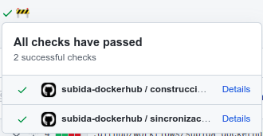
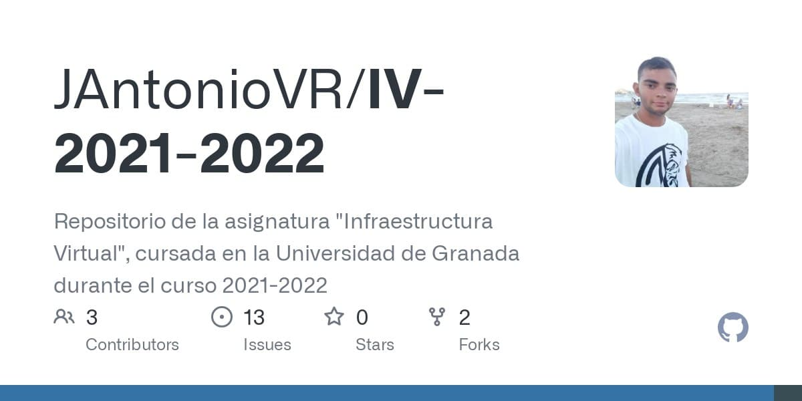

# Estructura general y planificación del proyecto

## Objetivo


Transformar puntuaciones y reseñas en información útil para el propietario y para empresas y sitios web turísticos.

## Propietario

<div style="display:flex">
<div style="width:30%">

</div>
<div style="width:70%">

* [HUO](https://github.com/JAntonioVR/IV-2021-2022/issues/12): Quiero saber cuáles son los aspectos positivos y negativos de mi negocio para saber en qué falla e intentar mejorarlo, para así contentar a los clientes y aumentar mi clientela.
* [HU1](https://github.com/JAntonioVR/IV-2021-2022/issues/13): Quiero conocer recomendaciones y sugerencias que me ayuden a mejorar mi restaurante en base a los aspectos positivos y negativos que tenga.
</div>
</div>

## Empresa de recomendación

<div style="display:flex">
<div style="width:30%">

</div>
<div style="width:70%">

* [HU2](https://github.com/JAntonioVR/IV-2021-2022/issues/14): Quiero tener información sobre los aspectos positivos y negativos de los restaurantes para saber cuáles recomendar.
</div>
</div>

## Milestones


. . .

[M0](https://github.com/JAntonioVR/IV-2021-2022/milestone/5): Elaboración y diseño de estructuras de datos

. . .

[M1](https://github.com/JAntonioVR/IV-2021-2022/milestone/6): Procesamiento del lenguaje natural

. . .

[M2](https://github.com/JAntonioVR/IV-2021-2022/milestone/8): Elaboración de estrategias

. . .

[M3](https://github.com/JAntonioVR/IV-2021-2022/milestone/9): Despliegue

# Comienzo de la implementación del proyecto

Desarrollado por [@Mapachana](https://github.com/Mapachana).

## Lenguaje utilizado


Se crea el módulo `review_set`

## `Resenia`
```python
@dataclass(frozen=True)
class Resenia:
    '''Clase que modela una reseña.
    Atributos:
    texto (string): Texto de la reseña.
    local_id (string): Cadena única que identifica a un local.
    puntuacion (int): Puntuación dada en la reseña.
    palabras_clave (List[string]): Palabras de la reseña.
    '''

    texto: str
    local_id: str
    puntuacion: int
    palabras_clave: List[str] = field(default_factory=list)
```

## `ConjuntoResenias`
```python
@dataclass
class ConjuntoResenias:
    '''Clase para almacenar un conjunto de reseñas.
    
    Atributos:
    resenias (List[resenia.Resenia]): Conjunto de reseñas 
                                      almacenado.
    '''

    resenias: List[resenia.Resenia]
```

# Automatización de operaciones

## Herramientas utilizadas


* Gestor de dependencias [`poetry`](https://python-poetry.org/).
* Gestor de tareas [`invoke`](https://www.pyinvoke.org/).
* Compilador [`py3compile`](http://manpages.ubuntu.com/manpages/trusty/man1/py3compile.1.html).

## Poetry

```ini
# pyproject.toml
[tool.poetry]
name = "IV-2021-2022"
version = "0.0.4"
description = "Proyecto de \"Infraestructura Virtual\"."
authors = ["JAntonioVR"]

[tool.poetry.dependencies]
python = "^3.8"

[tool.poetry.dev-dependencies]
pytest = "^6.1.2"
```
* `poetry add [-D] <package>`
* `poetry install`

## Invoke

Link: [Uso de Invoke](https://github.com/JAntonioVR/IV-2021-2022/tree/Objetivo-3#uso-de-invoke).

```python
# tasks.py
# ─── COMPROBAR SINTAXIS ────────────────────────────
@task
def check(c):
    '''
    Comprueba la sintaxis de los ficheros de código
    '''
    module = "resenia"
    print("Comprobando sintaxis...")
    if(c.run("py3compile " + module)):
        print("OK")
```
La tarea anterior se puede ejecutar simplemente con `invoke check`.

# Test

## Framework de test
Uso del framework `pytest`.


## ¿Qué se testea en esta fase?

Implementar más lógica de negocio para testear:

. . .

* Constructores
* Nombres de ficheros correctos
* Casos anómalos
* Métodos
* Integridad

. . .

Hay que testear cualquier funcionalidad que se añada a la aplicación

## Uso de pytest

```python
import pytest
from review_set.conjunto_resenias import ConjuntoResenias

def test_constructor_conjunto_resenias_nulo():
    '''
    Comprueba que el constructor de la clase ConjuntoResenia 
    crea un conjunto vacío si no se especifica ningún dataset
    '''
    review_set = ConjuntoResenias()
    assert(review_set != None and \
        isinstance(review_set, ConjuntoResenias) and \
        review_set.numero_resenias() == 0)
```

## Uso de pytest

```bash
$ pytest
==================== test session starts ====================
platform linux -- Python 3.8.10, pytest-6.2.5, py-1.11.0, 
pluggy-0.13.0
rootdir: /IV-2021-2022
plugins: anyio-2.2.0
collected 6 items                                                                                    

test/test_resenia.py .....                            [100%]

===================== 6 passed in 0.17s =====================
```

# Contenedores

## Creación de un contenedor para pruebas


Aprovechamos el gestor de dependencias y el de tareas para [crear un contenedor](https://github.com/JAntonioVR/IV-2021-2022/blob/Objetivo-5/Dockerfile) que realice las pruebas.

## Contenedor base

* Testeo de código Python e instalación de `Poetry`.
* Ligero
* Construcción rápida 

**Posibilidades**: `python:<version>`, `python:<version>-slim`, `python:<version>-alpine` y `python:<version>-windowsservercore`

Link: [Parámetros de búsqueda](https://github.com/JAntonioVR/IV-2021-2022/tree/Objetivo-5#par%C3%A1metros-de-b%C3%BAsqueda), [Pruebas](https://github.com/JAntonioVR/IV-2021-2022/tree/Objetivo-5#pruebas)

**Elección final**: `python:3.8-slim`

## Uso del contenedor

```bash
$ docker run -t -v `pwd`:/app/test jantoniovr/iv-2021-2022
===================== test session starts =====================
platform linux -- Python 3.8.12, pytest-6.2.5, py-1.11.0, 
 pluggy-1.0.0
rootdir: /app/test
collected 6 items

test/test_resenia.py ......                             [100%]

====================== 6 passed in 0.12s ======================
```

## Sincronización con Dockerhub

En cada `push` se actualiza la imagen y el `README.md` en dockerhub gracias a una 'GitHub Action'.



# Integración continua

## Alternativas
<div style="display:flex">


</div>

<div style="display:flex">


</div>

## Parametrización de la construcción del contenedor

```dockerfile
ARG PYTHON_VERSION=3.8-slim
FROM python:${PYTHON_VERSION}
```

```bash
$ docker build \
    --build-arg PYHTON_VERSION=<version> \
    -t jantoniovr/iv-2021-2022:<version> 
    .
```

```bash
docker run -t -v `pwd`:/app/test \
    jantoniovr/iv-2021-2022:<version>
```

## Testeo de versiones
Se testea el proyecto en las versiones 3.8, 3.9 y 3.10 de Python.

. . .

Usamos contenedores que usan distintos contenedores base.

. . .

Testeamos versión 3.8 en **Github Actions** y versiones 3.9 y 3.10 en **Circle CI**

## En GitHub Actions

```yaml
# Ejecucion de los test con el contenedor base 3.8-slim
  test:
    runs-on: ubuntu-latest
    steps:
      - uses: actions/checkout@v2
      - run: docker run -t -v `pwd`:/app/test \
            jantoniovr/iv-2021-2022:3.8-slim
```

## En Circle CI

```yaml
jobs:
  # Testeado del código con las distintas versiones de Python
  test:
    parameters:
      python-version:
        type: string
    docker:
      - image: 
        jantoniovr/iv-2021-2022:<< parameters.python-version >>
    steps:
      - checkout
      - run: invoke test
```
## 

```yaml
workflows:
  ejecuta_test: 
    jobs:
      - test:
          matrix:
            parameters:
              python-version: ['3.10-slim', '3.9-slim']
```

# Referencias

<ul>
<li><a href="https://www.flaticon.com/free-icons/restaurant" title="restaurant icons">Restaurant icons created by Freepik - Flaticon</a></li>

<li><a href="https://www.flaticon.com/free-icons/entrepreneur" title="entrepreneur icons">Entrepreneur icons created by monkik - Flaticon</a></li>

<li><a href="https://www.flaticon.com/free-icons/tripadvisor" title="tripadvisor icons">Tripadvisor icons created by pictogramer - Flaticon</a></li>

<li><a href="https://www.flaticon.es/iconos-gratis/matrioska" title="matrioska iconos">Matrioska iconos creados por Nikita Golubev - Flaticon</a></li>

<li><a href="https://www.flaticon.es/iconos-gratis/github" title="github iconos">Github iconos creados por Pixel perfect - Flaticon</a></li>

<li><a href="https://www.flaticon.com/free-icons/repair" title="repair icons">Repair icons created by Freepik - Flaticon</a></li>
</ul>

## Fin de la presentación
<a href=https://github.com/JAntonioVR/IV-2021-2022>

</a>