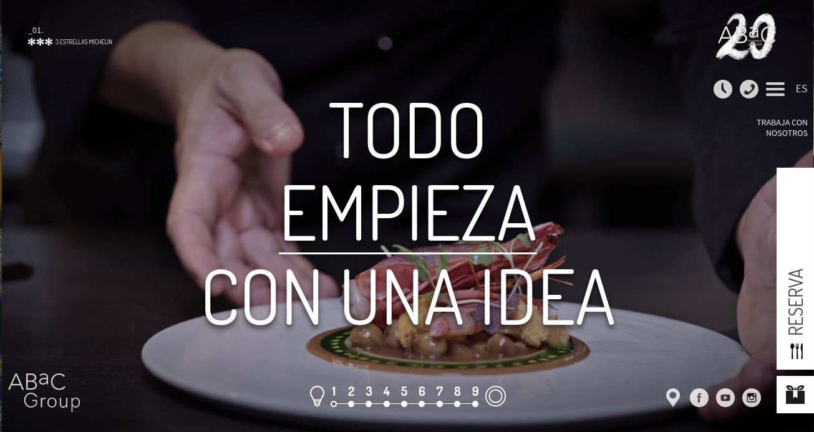

# Dos enfoques

Dos puntos de vista distintos:

::: columns

:::: {.column width="40%"}

Diseño web

::::

:::: {.column width="40%"}

**Programación web**

::::

:::

## Diseño vs. Programación

::: columns

:::: {.column width="50%"}

* Diseñadores, artistas
* Importancia al aspecto visual
* Bajos conocimientos en programación

::::

:::: {.column width="50%"}

* Ingenieros, programadores
* Importancia a la funcionalidad
* Necesidad de conocimientos en programación

::::

:::

. . .

Lo ideal: **EQUILIBRIO**

## Diseño vs. Programación

Aunque depende del propósito

::: columns

:::: {.column width="50%"}

 

* [Documentación de Python](https://docs.python.org/3/)
* [El mundo](https://www.elmundo.es/)

::::

:::: {.column width="50%"}

 

* [ABaC](https://abacrestaurant.com/es/)
* [Hotel Arts Barcelona](https://www.hotelartsbarcelona.com/)

::::

:::

## Diseño vs. Programación

Ambas confluyen en un aspecto:

. . .

 
La Experiencia de Usuario

## Diseño vs. Programación

::: columns

:::: {.column width="50%"}

 

::::

:::: {.column width="50%"}

 

* Webs fáciles de utilizar
* Accesibles
* Coherentes

::::

:::

## Diseño Web

::: columns

:::: {.column width="40%"}

::::

:::: {.column width="40%"}

::::

:::

Cuidado de la apariencia, la disposición de los elementos, las proporciones, la gama de colores...

## Programación Web

Varios paradigmas, se suele enseñar el Modelo-Vista-Controlador.

Funcionalidad, cuidado del código, independencia entre capas.

## Lenguajes y sistemas

Para que todo funcione correctamente:

* Servidor web
* Dominio y alojamiento web.

# Herramientas

## Para diseñadores

::: columns

:::: {.column width="30%"}

Adobe Illustrator

::::

:::: {.column width="30%"}

Figma

::::

:::: {.column width="30%"}

Adobe XD

::::

:::

## Para diseñadores

## Para programadores

* Editores de código: VSCode, Emacs, Atom, ...
* Frameworks y bibliotecas:
  * En el lado del servidor: Django, Flask, phpMyAdmin, node.js,...
  * En el lado del cliente: Bootstrap, Tailwind, jQuery, motores de plantillas...

# Web de Innovaciencias

## Software utilizado

# Conclusiones

* No hay diseño sin programación ni programación sin diseño
* Cuidado del producto y del consumidor (usuario)
* Libertad en el uso de herramientas
* Cada aplicación es diferente

## Referencias

* <a href="https://www.flaticon.com/free-icons/data" title="data icons">Data icons creados por Freepik - Flaticon</a>
* <a href="https://www.flaticon.com/free-icons/front-end" title="front-end icons">Front-end icons creados por Flat Icons - Flaticon</a>
* <a href="https://www.awwwards.com/sites/inomaly-abstract-wall-art">Inomaly abstract wall art - Awwwards</a>
* <a href="https://www.flaticon.com/free-icons/mood-board" title="mood-board icons">Mood-board icons creados por Freepik - Flaticon</a>
* <a href="https://www.flaticon.es/iconos-gratis/negocios-y-finanzas" title="negocios y finanzas iconos">Negocios y finanzas iconos creados por Muhammad Atif - Flaticon</a>
* <a href="https://www.behance.net/gallery/85873667/Photographers-Portfolio-Landing-Page?tracking_source=search_projects_views%7CPhotographer+Portfolio">Photographers Portfolio Landing Page - Behance</a>
* <a href="https://www.flaticon.com/free-icons/web-programming" title="web programming icons">Web programming icons creados por SBTS2018 - Flaticon</a>
* <a href="https://www.awwwards.com/sites/uptown-cocktails">Uptown Cocktails - Awwwards</a>

## Muchas gracias por su atención

<h2>¿Alguna pregunta?</h2>